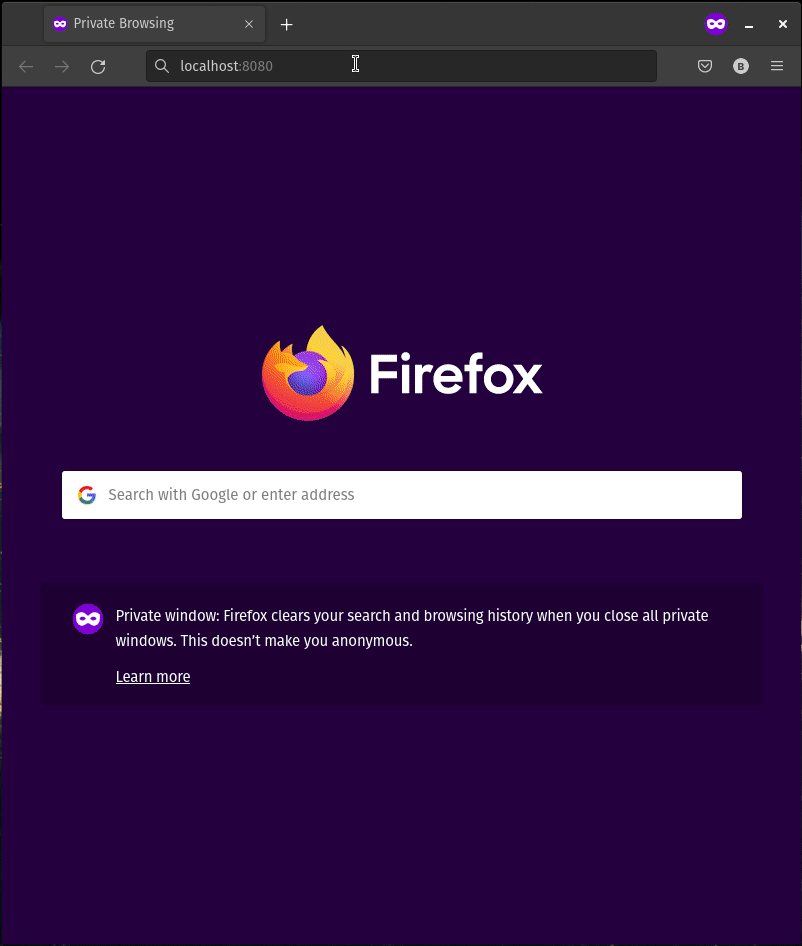

# DewNews - A Fable App

A small fable project which pulls some topics from [Hacker News](https://news.ycombinator.com). Done as a hobby for learning and experimenting F# on frontend with [Fable](https://fable.io/).



## Quick run

Download the [release](appRelase/dewNews.zip), unzip and open __index.html__ with your favorite browser.

## Build & develop

### Requirements

* [dotnet SDK](https://www.microsoft.com/net/download/core) 5.0 or higher
* [Paket](https://fsprojects.github.io/Paket/) v6.2.1 - package manager for dotnet
* [node.js](https://nodejs.org)
* An F# editor like Visual Studio, Visual Studio Code with [Ionide](http://ionide.io/) or [JetBrains Rider](https://www.jetbrains.com/rider/)

### Build

```
# install dotnet dependencies
paket install

# install node dependencies
npm install

# build the project into ./public folder
npm run build

# or simply run in watch mode, maybe for development etc.
npm start
```
